**Collaborator:** aidlc-architect-agent

# Functional Spec - Unit chat-frontend

Especificacao de workflow e maquina de estados do frontend Streamlit (U1
`chat-frontend`, kind: ui). Fontes: `unit-of-work.md`,
`unit-of-work-story-map.md`, `requirements.md`, `components.md`,
`contract-summary.md`. Reusa `mockups.md`, `interaction-spec.md` e
`design-system-mapping.md` de Inception como base.

## Sources

- [uw] `unit-of-work.md` - U1 chat-frontend (ui, M) contem HRChatFrontend e AgentInvoker.
- [sm] `unit-of-work-story-map.md` - 4 stories em U1: US1.6, US1.7, US1.9, US4.1.
- [rq] `requirements.md` - FR4.1-4.5, FR7.1-7.2, FR8.1-8.2, FR9.1-9.3, NFR1.1, NFR2.1, NFR3.2.
- [cp] `components.md` - HRChatFrontend + AgentInvoker sao os componentes desta unit.
- [cs] `contract-summary.md` - C1 payload (`{prompt, context.model_id}` -> `{response, model_id, session_id}`); C2 CFN outputs.
- [is] `interaction-spec.md` (refined-mockups) - 9 componentes (C1..C9).
- [mk] `mockups.md` - copy exata; state machine.

## Screens

O MVP tem **uma unica tela** (`streamlit run frontend/app.py`). Layout
final em `mockups.md § Tela unica`. Sem paginacao, sem tabs, sem
progressive disclosure.

## State Machine

Estados da sessao de chat, mapeando 1:1 com os estados de
`mockups.md § Estados agregados`:

```mermaid
stateDiagram-v2
  [*] --> Idle
  Idle --> Typing: usuario foca chat_input
  Typing --> Idle: perde foco / limpa
  Typing --> Sending: submit valido (<=4000 chars)
  Typing --> Idle: submit invalido (>4000 chars, st.warning)
  Sending --> Responded: ask_agent retorna string nao-vazia
  Sending --> ErrorState: AgentInvocationError
  Responded --> Idle: rerun completa
  ErrorState --> Idle: usuario reenvia ou continua digitando
  Idle --> Idle: troca de modelo (model_id atualizado; sem transicao logica)
  Idle --> Idle: limpar conversa (session_id novo + messages resetado; volta para saudacao)
```

Nota: "troca de modelo" e "limpar conversa" sao transicoes ortogonais que
retornam ao estado Idle sem passar por Sending. `limpar conversa` reseta
`session_id` e `messages` para o estado inicial (bolha unica de saudacao).

**Colapso de transicoes**: Streamlit rerun ao final de qualquer turno
converte `Responded` e `ErrorState` em `Idle` antes que Clear ou
ModelChange possam disparar. Durante `Sending` a UI e sincrona (spinner
bloqueia interacoes ate o retorno de `ask_agent`). Portanto Clear e
ModelChange sao definidos apenas a partir de `Idle` no diagrama - o que
cobre todos os fluxos observaveis do usuario.

## Workflows por AC

### AC1.6.1 - Rejeitar input >4000 chars

**Trigger**: usuario submete `prompt` com `len(prompt) > 4000`.
**Steps**:
1. `frontend/app.py` recebe `prompt` do `st.chat_input(...)` submit.
2. Verifica `len(prompt) > 4000`.
3. Renderiza `st.warning("Sua pergunta ficou muito longa para eu processar. Tente resumir em uma unica pergunta mais curta.")`.
4. **NAO** chama `ask_agent(...)`.
5. `st.session_state.messages` permanece inalterado.
6. Rerun do Streamlit; estado volta a Idle.

**Guard primario** (defense-in-depth): `src/invoke.py::ask_agent` tambem
valida `len(prompt) > 4000` e levanta `ValueError` antes da chamada
boto3 [cs C1, tp § Code Style Error handling].

### AC1.6.2 - Aceitar input <=4000 chars

**Trigger**: usuario submete `prompt` com `len(prompt) <= 4000`.
**Steps**:
1. `frontend/app.py` recebe `prompt`.
2. Append `{"role": "user", "content": prompt}` a `st.session_state.messages`.
3. Renderiza bolha do usuario via `st.chat_message("user")`.
4. Renderiza `st.chat_message("assistant")` com `st.spinner("Consultando base de conhecimento...")`.
5. Chama `ask_agent(prompt, st.session_state.session_id, st.session_state.model_id)`.
6. Segue para AC1.7.x (sucesso ou erro).

### AC1.7.1 - Re-raise ClientError como AgentInvocationError

**Boundary**: `src/invoke.py::ask_agent`.
**Steps**:
1. Chama `agentcore_client.invoke_agent_runtime(agentRuntimeArn=..., runtimeSessionId=session_id, payload=<json bytes de C1>)`.
2. Se botocore `ClientError` (`ThrottlingException`, `ValidationException`, `ResourceNotFoundException`, `AccessDeniedException`, `InternalServerException`, timeout), captura.
3. Levanta `AgentInvocationError(message="<mensagem legivel>", cause=client_error)`.
4. Se resposta 200 OK sem campo `response` ou string vazia, levanta `AgentInvocationError("Resposta vazia do agente")`.
5. Log do `ClientError` original via `logging.getLogger(__name__).error("AgentCore invocation failed", exc_info=err)`.

### AC1.7.2 - Renderizar erro amigavel

**Trigger**: `AgentInvocationError` capturado no `frontend/app.py`.
**Steps**:
1. `try: resposta = ask_agent(...)` bloco em `frontend/app.py`.
2. `except AgentInvocationError as err:`
3. `logging.getLogger(__name__).error("AgentCore invocation failed", exc_info=err)` (AC1.7.3).
4. Renderiza `st.error("Nao consegui responder agora. Tente novamente em alguns segundos ou contate o RH se o problema persistir.")` no lugar do texto da bolha.
5. Bolha do usuario que disparou continua visivel em `st.session_state.messages`.
6. **NAO** faz append da bolha vazia do assistente (evita bolha fantasma).
7. Rerun completa; estado volta a Idle.

### AC1.7.3 - Logger de debug

Executado dentro do bloco `except` (AC1.7.2, step 3). `logging.getLogger(__name__).error(...)` grava no logger local do Streamlit. Nao envia para sink externo [project.md § Forbidden].

### AC1.9.1 - Botao "Limpar conversa" visivel

**Steps**:
1. Sidebar renderiza `st.sidebar.button("Limpar conversa", on_click=_clear_conversation, key="clear_chat")`.
2. Button focavel por Tab.
3. Sem confirmation dialog [mk § US1.9].

### AC1.9.2 - Novo session_id via uuid.uuid4()

**Handler `_clear_conversation`**:
1. `import uuid` (top-level).
2. `st.session_state.session_id = str(uuid.uuid4())`.
3. NUNCA aceita de input do usuario, query string ou header [project.md § Mandated NFR3.2].

### AC1.9.3 - Messages resetado ao estado inicial

**Interpretacao literal vs funcional**: a redacao de AC1.9.3 em stories.md
diz "messages esta zerado (`[]`)". Adotamos leitura **funcional**:
`messages` resetado ao **estado inicial** (bolha unica de saudacao),
harmonizando com AC1.9.5 (que exige bolha de saudacao pos-clear). O
predicado testavel e `len(messages) == 1 and messages[0]["role"] == "assistant"`
e nao `messages == []`.

**Handler `_clear_conversation`** continua:
4. `st.session_state.messages = [{"role": "assistant", "content": GREETING_MESSAGE}]`.
5. Nenhuma outra chave de `st.session_state` e alterada (model_id preservado).

### AC1.9.4 - Proxima chamada usa novo session_id

**Steps**:
1. Apos `_clear_conversation`, Streamlit executa rerun automatico.
2. `frontend/app.py` re-renderiza com o novo `st.session_state.session_id`.
3. Proximo submit valido chama `ask_agent(prompt, st.session_state.session_id, st.session_state.model_id)`.
4. `AgentInvoker` passa `session_id` como `runtimeSessionId` ao `invoke_agent_runtime` [cs AWS-owned].
5. AgentCore Runtime aloca nova microVM para essa `runtimeSessionId` (garantia do servico).

### AC1.9.5 - Estado inicial com saudacao

**Steps**:
1. Apos rerun de `_clear_conversation`, `st.session_state.messages` = `[<bolha saudacao>]`.
2. `render_chat_history()` itera e renderiza a bolha unica.
3. Copy exata: `"Ola! Sou o assistente de RH. Posso ajudar com politicas de RH, ferias, onboarding e avaliacoes. Qual sua duvida?"` [mk].

### AC4.1.1 - Dropdown de modelo visivel na sidebar

**Steps**:
1. Sidebar renderiza `st.sidebar.selectbox("Modelo de chat", options=MODEL_OPTIONS, index=..., key="model_selector")`.
2. `MODEL_OPTIONS = ["Claude Haiku 4.5", "Amazon Nova Pro"]` (>=2 opcoes).

### AC4.1.2 - model_id observavel no output

**Steps**:
1. Frontend passa `st.session_state.model_id` como `context.model_id` no payload C1 do request.
2. `HRAgent` (U2) inclui `model_id` no response do payload C1.
3. Frontend pode inspecionar `response["model_id"]` para verificar qual modelo respondeu. Alternativamente, `st.caption(f"Modelo em uso: {st.session_state.model_id}")` no cabecalho ja materializa isso na UI (mockups.md).

### AC4.1.3 - Inference profile ARN

**Decisao (resolve Q3 de contract-summary § Open questions)**: **U1 nao
resolve label -> ARN. U1 envia apenas o label** (`context.model_id`) no
payload C1; **U2 (hr-agent) resolve para o inference profile ARN em
runtime** consumindo as env vars `INFERENCE_PROFILE_ARN_CLAUDE_HAIKU` /
`INFERENCE_PROFILE_ARN_NOVA_PRO` injetadas pelo IAM execution role
(contract-summary § C3).

**Steps** (do ponto de vista de U1):
1. Frontend le `st.session_state.model_id` (o label humano ja setado por W3).
2. Passa label no payload de request: `{"prompt": ..., "context": {"model_id": <label>}}` [cs C1 request schema].
3. Frontend NAO conhece o ARN. Nao ha `MODEL_ARNS` em U1.

**Steps** (do ponto de vista de U2, referencia para code-generation de
U2 - detalhado em `construction/hr-agent/functional-design/`):
4. U2 recebe `context.model_id` do payload.
5. U2 mapeia via dicionario interno label -> env var (`"Claude Haiku 4.5"` -> `INFERENCE_PROFILE_ARN_CLAUDE_HAIKU`).
6. U2 le a env var correspondente (`os.environ[...]`), obtendo ARN completo com prefixo `arn:aws:bedrock:us-east-1:...:inference-profile/us.*` [project.md § Mandated].
7. U2 passa o ARN a `BedrockModel(model_id=<ARN>)`.

Verificacao AC4.1.3 e do lado de U2, nao de U1. U1 contribui pela
transmissao correta do label no payload.

**Contrato desta decisao (efeitos em outros artefatos)**:

- `contract-summary.md § Open questions Q3`: RESOLVIDA para opcao "label no payload; U2 resolve via env vars C3".
- Nenhuma mudanca em C1 request schema (sem `context.model_arn`).
- Reuso de C3 env vars `INFERENCE_PROFILE_ARN_*` ja declaradas (nao mais "optional") - agora obrigatorias para os 2 modelos ativos.

### AC4.1.4 - Troca de modelo preserva historico

**Steps**:
1. Usuario troca opcao no `st.selectbox("Modelo de chat", ...)`.
2. Streamlit rerun; `st.session_state.model_id` atualiza.
3. `st.session_state.messages` NAO e limpo.
4. `st.session_state.session_id` NAO muda.
5. Proximo submit usa novo `model_id`; historico permanece visivel.

## Business Scenarios (E2E user journeys)

**Cenario feliz**: Ana abre `http://localhost:8501` -> ve saudacao ->
digita "Quantos dias de ferias?" -> Enter -> spinner "Consultando..." ->
resposta em <=5s -> ve texto plano em portugues -> digita segunda pergunta
no mesmo `session_id`.

**Cenario input longo**: Ana cola texto de 5000 chars -> Enter ->
`st.warning` amigavel -> nao chega no AgentCore -> reformula.

**Cenario erro**: Ana pergunta durante throttling -> `st.error` -> tenta
de novo em segundos -> resposta chega.

**Cenario limpar**: Ana conversou por 3 turnos -> quer mudar de assunto ->
clica "Limpar conversa" -> saudacao reaparece -> nova pergunta usa novo
`session_id`.

**Cenario troca de modelo**: Operador do workshop troca Claude Haiku ->
Amazon Nova Pro na sidebar -> historico preservado -> proxima resposta
vem do Nova Pro.

## Frontend hierarchy summary

Detalhado em `frontend-components.md`; resumo aqui: `Page` >
`PageHeader` (title + model caption) + `Sidebar` (ModelSelector +
ClearConversation) + `ChatArea` (History + Input + optional CharCounter)
+ `MessageRenderer` (chat_message per message).

## Assumptions & Open Questions

Resolucoes das open questions deferidas de `contract-summary.md § Open questions`:

- **Q1** (Ecoa `context.model_id` no response? Ou U2 escreve por conta propria?): RESOLVIDA. AC4.1.2 step 2 fixa que **U2 (`HRAgent`) escreve `model_id` no response** do payload C1. U1 nao ecoa; consome o `model_id` recebido no response para verificacao pos-facto.
- **Q3** (INFERENCE_PROFILE_ARN via env var de U2 ou via payload?): RESOLVIDA na secao AC4.1.3 acima. **U1 envia apenas o label**; **U2 resolve para ARN via env vars C3**. `MODEL_ARNS` REMOVIDO do escopo de U1.

None outras.

<!-- confirmed 2026-08-25 -->

## Review

**Reviewer:** aidlc-architecture-reviewer-agent
**Verdict:** READY
**Date:** 2026-08-25T13:21:26Z
**Iteration:** 2
**Review class:** adversarial

### Status dos findings da iteracao 1

| # | Sev iter-1 | Status iter-2 | Evidencia |
|---|------------|---------------|-----------|
| 1 | Major | RESOLVIDO | `AC4.1.3` reescrita: U1 envia apenas o label em `context.model_id` (steps 1-3), sem `MODEL_ARNS` no frontend. Consistente com `contract-summary.md § C1` (schema request contem `context.model_id: string` e nada mais). Sem referencia a `context.model_arn` em qualquer ponto. Q3 registrada como RESOLVIDA na secao Assumptions & Open Questions e refletida em `traceability.json` AC4.1.3 target ("U1 envia label; U2 hr-agent resolve para inference profile ARN via C3 env vars"). |
| 2 | Major | RESOLVIDO | `MODEL_ARNS` foi retirado do escopo de U1. `frontend-components.md § W3` afirma explicitamente "**U1 nao carrega `MODEL_ARNS`**" e delega label->ARN para U2 via env vars C3. Nenhum placeholder `{account_id}`/`{suffix}` sobrou. Consistente com `contract-summary.md § C2` (env vars de U1 continuam apenas `AGENT_RUNTIME_ARN` + `AWS_REGION`). Finding vira moot como previsto na recomendacao do iter-1. |
| 3 | Minor | RESOLVIDO | Bloco "Interpretacao literal vs funcional" em `AC1.9.3` fixa o predicado testavel `len(messages) == 1 and messages[0]["role"] == "assistant"` e nega explicitamente `messages == []`. |
| 4 | Minor | RESOLVIDO | "Assumptions & Open Questions: None" substituido por resolucao explicita de Q1 (U2 escreve `model_id` no response - AC4.1.2 step 2) e Q3 (label-only + U2 resolve via C3). |
| 5 | Minor | RESOLVIDO | `W8` renomeado para "CharCounter hint (post-submit hint para proxima mensagem)"; copy revisada para `"Sua ultima pergunta teve {n}/4000 caracteres. Tente ser mais direta na proxima."`; texto do widget agora afirma "NAO clama contribuir a AC1.6.1"; AC field lista `(nenhum direto; UX hint opcional)`. |
| 6 | Minor | RESOLVIDO | Nota "Colapso de transicoes" adicionada abaixo do diagrama, cobrindo rerun Streamlit (Responded/ErrorState -> Idle) e UI sincrona durante Sending. |
| 7 | Minor | RESOLVIDO | `frontend-components.md § Logging config` adiciona `logging.basicConfig(level=logging.INFO, format="%(asctime)s %(name)s %(levelname)s %(message)s")` como top-level de `frontend/app.py`. |

### Verificacoes novas (iter-2)

| Criterio | Resultado | Evidencia |
|----------|-----------|-----------|
| Nao ha novos `context.model_arn` ou variantes no C1 do design | PASS | `grep` em functional-spec: unica ocorrencia de "model_arn" e a frase negativa "Nao ha `MODEL_ARNS` em U1". Nenhuma extensao do payload C1. |
| Traceability AC4.1.3 target valido apos re-write | PASS | Target aponta para `functional-spec.md § AC4.1.3` (existe) + observacao de que a verificacao end-to-end mora em U2's functional-design. Spot-check de referencia cruzada e legitimo aqui (design nomeia integracao com U2 explicitamente). |
| Consistencia com `stories.md § AC4.1.3` (`o codigo do agente resolve o inference profile ARN`) | PASS | Leitura literal da story fala em "codigo do agente" - naturalmente U2 (hr-agent). A nova decomposicao (U1 transmite label; U2 resolve ARN) alinha com a redacao original. `traceability.json` marca `OK` porque U1 contribui pela transmissao correta do label; verificacao E2E fica no artefato de U2 - decomposicao coerente. |
| C1 continua additive-only apos as revisoes | PASS | Request permanece `{prompt, context.model_id?}`; response `{response, model_id, session_id}`. Sem breaking change em nenhuma direcao. |
| Nota de "efeito em outros artefatos" para C3 env vars | ADVISORY | Assumptions & Open Questions afirma que `INFERENCE_PROFILE_ARN_*` "agora obrigatorias para os 2 modelos ativos" - `contract-summary.md § C3` ainda marca ambas como `optional: true`. Nao e finding contra este stage (contract-summary e artefato de Inception, e o texto atual de U1 e transparente sobre o efeito downstream); a atualizacao formal do optional-flag e responsabilidade do futuro stage de U2 ou de um patch a Inception. Documentado aqui como advertencia para code-generation, nao como bloqueio. |
| W8 sem `last_prompt` no session_state schema | ADVISORY | O novo hint referencia uma variavel `last_prompt` que nao consta do schema. Um developer pode deriva-la em runtime de `messages[-1]["content"]` quando `messages[-1]["role"] == "user"`. Nao bloqueia: W8 e opcional (`AC: (nenhum direto; UX hint opcional)`), e a mecanica e obvia. |

### Cobertura consolidada (herdada de iter-1)

Todos os 14 ACs de chat-frontend continuam com workflow proprio, widget catalogue mantem W1..W10 sem lacunas, session state schema fechado (3 chaves), constants preservam copy literal das stories, boundary de error handling (AC1.7.1 em `src/invoke.py`; AC1.7.2/1.7.3 em `frontend/app.py`) intacto, session_id via `uuid.uuid4()` server-side, upstream coverage (`uw`, `sm`, `rq`, `cp`, `cs`, `mk`, `is`) referenciado nas fontes.

### Summary

Iteracao 2 resolve os dois Major da iteracao 1 pela via mais barata (opcao b: label-only no payload + delegacao integral a U2 via C3 env vars) e absorve todos os cinco Minor. C1 permanece intacto - a decisao remove complexidade de U1 sem tocar no schema compartilhado. As duas advertencias remanescentes (optional-flag de `INFERENCE_PROFILE_ARN_*` em C3; `last_prompt` implicito em W8) sao coordenacoes downstream e escolhas obvias de implementacao, nao architetura pendente. Design implementavel: um developer consegue construir `frontend/app.py` e o wire para `src/invoke.py::ask_agent` sem precisar reabrir Inception. Verdict: READY.
