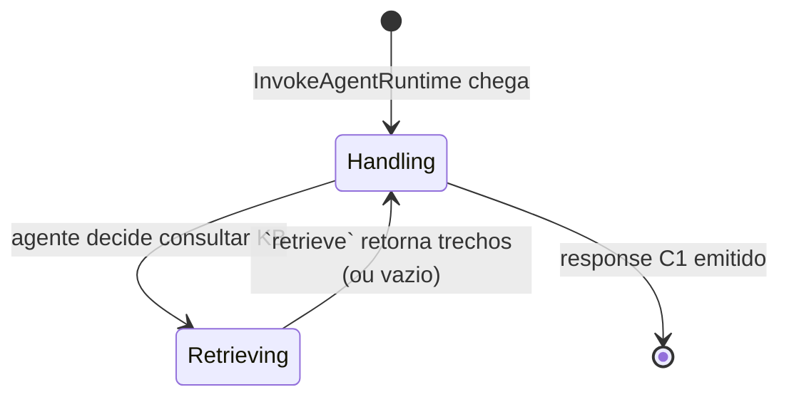
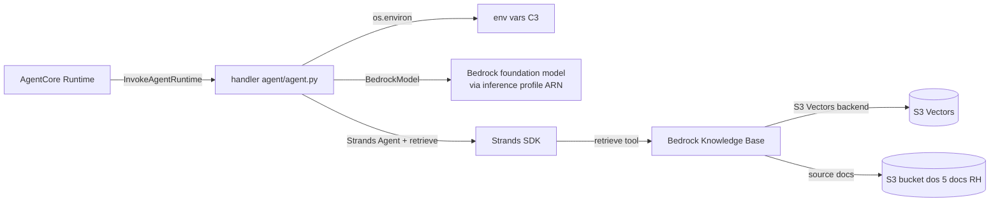

**Collaborator:** aidlc-architect-agent

# Functional Spec - Unit hr-agent

Especificacao comportamental do agente Strands (U2, kind: `service`).
Fontes: `unit-of-work.md`, `unit-of-work-story-map.md`, `requirements.md`,
`components.md`, `contract-summary.md`. Companion de `entities.md`
(source-of-truth de dados; vazio por design) e `rules.md`
(source-of-truth de regras). Este arquivo e a **source-of-truth de
workflow**.

## Sources

- [uw] `unit-of-work.md` § U2 hr-agent - kind service, isolado de src/
  e frontend/.
- [sm] `unit-of-work-story-map.md` - 7 stories em U2 (US1.1, US1.2,
  US1.3, US1.4, US1.5, US2.1, US3.1).
- [rq] `requirements.md` - FR1.1-1.5, FR3.1-3.2, FR5, FR6, FR7,
  NFR2.1, NFR3.1, NFR3.2, NFR4.1, NFR8.2, NFR10.1.
- [cp] `components.md` § HRAgent - behaviour + zero entities.
- [cs] `contract-summary.md` § C1 (payload) + § C3 (env vars).
- [en] `entities.md` deste unit - stateless, zero entities.
- [rl] `rules.md` deste unit - BR1..BR7.

## Deployment shape

- **Onde roda**: dentro de uma microVM gerenciada pelo Amazon Bedrock
  AgentCore Runtime, provisionada por U3 `infra`. Uma microVM por
  `runtimeSessionId` recebida (garantia NFR3.1).
- **Como e invocado**: sincronicamente via `bedrock-agentcore.
  InvokeAgentRuntime` (C1 request), single-shot, sem streaming.
- **Superficie publica**: um handler que le o payload C1 e retorna o
  payload C1 (`{prompt, context?}` -> `{response, model_id,
  session_id}`).
- **Codigo**: `agent/agent.py` como entrypoint; nao importa `src/`
  nem `frontend/` (fronteira de camada, `team.md § Code Style`).
- **Deps**: `strands`, `strands_tools`, `boto3`, pinados em
  `agent/requirements.txt`.

## State (or explicit absence thereof)

**Nao ha state machine no agente**. Decisao Q4 = A (BR7.1): stateless
por invocacao. Cada chamada e um ciclo unico e independente:



O diagrama acima descreve o ciclo interno de UMA invocacao, nao um
estado persistente entre invocacoes. Nao ha `Idle` / `Waiting` / etc.
entre chamadas - o proprio processo do agente pode nem existir entre
turnos (comportamento do Runtime).

Consequencias:
- Historico de conversa vive em `chat-frontend` (`ChatSession`, em U1).
- `retrieve` e chamado em toda invocacao que precisa RAG (sem cache
  entre turnos).
- AgentCore Memory (NFR10.1) esta `Deferred` - se instalado no dia 2,
  altera este contrato (adicionar leitura de historico no `Handling`).

## System prompt architecture (Q1 = B, ver BR2.1)

O system prompt e composto de 4 constantes de modulo em `agent/agent.py`,
concatenadas em `_SYSTEM_PROMPT` no top-level:

```
_ROLE_SECTION      -> quem e o agente + escopo (5 documentos indexados)
_LGPD_SECTION      -> proibicao dados individuais + resposta canonica
_FALLBACK_SECTION  -> instrucao literal do fallback "nao encontrei"
_TONE_SECTION      -> 2-4 frases, formal-neutro, pt-BR, sem emojis

_SYSTEM_PROMPT = "\n\n".join([
    _ROLE_SECTION, _LGPD_SECTION, _FALLBACK_SECTION, _TONE_SECTION
])
```

Ordem das secoes importa: _ROLE define papel; _LGPD tem prioridade
alta antes de qualquer outra instrucao ler o prompt; _FALLBACK segue
para nao ser diluido; _TONE fecha para o modelo carregar as
restricoes de saida como as ultimas instrucoes.

Cada secao e testavel isoladamente (BR2.2-BR2.5): assertions como
`"NUNCA divulgar informacoes individuais" in _LGPD_SECTION` cobrem a
fiacao das secoes ao teste unitario LGPD (BR4.3).

**Copy exato de cada secao e escolhido em `code-generation`**, mas a
composicao (numero de secoes, nomes, ordem) esta fixada aqui.

## Handler workflow (single invocation)

Passo a passo do handler que o AgentCore Runtime invoca a cada
`InvokeAgentRuntime`:

1. **Parse payload C1 request**:
   - Ler `prompt` (obrigatorio, `str`, len <= 4000 - guard e cross-unit,
     ver contract-summary; U2 recebe payloads ja validados).
   - Ler `context.model_id` (obrigatorio de fato; se ausente, o handler
     falha rapido - BR6.3 e BR6.4). Nao ha fallback silencioso para
     modelo default no MVP.
   - Ler `runtimeSessionId` (do envelope AWS API, nao do payload;
     usado apenas como echo em BR7.2).
2. **Resolver label -> ARN** (BR6.1):
   - `arn = os.environ[_MODEL_LABEL_TO_ENVVAR[label]]`.
   - Se `label` desconhecido ou env var ausente: KeyError propaga (BR6.3);
     Runtime traduz em falha; chat-frontend renderiza `st.error`.
3. **Instanciar `BedrockModel`** com o ARN:
   - `model = BedrockModel(model_id=arn)`.
   - Sem `max_tokens` (Q2 = A, BR5.1). Sem `associatedGuardrailArn`
     no MVP (cross-unit decisao U1 `nfr-design § D7`).
4. **Instanciar agente Strands** com system prompt + tool `retrieve`:
   - `agent = Agent(model=model, system_prompt=_SYSTEM_PROMPT,
     tools=[retrieve])`.
   - `retrieve` do `strands_tools` le `KNOWLEDGE_BASE_ID` do env
     (BR2.4, cs § C3). Nao passa `numberOfResults` custom (default do
     SDK), sem filtros - decisao Q3 = A (BR3.1 confia na heuristica
     do prompt para detectar retrieve vazio).
5. **Invocar o agente**:
   - `result = agent(prompt)` (chamada sincrona).
   - Strands internamente chama `retrieve` se o modelo julga
     necessario; retorna string de resposta.
6. **Montar response C1** (BR6.2, BR7.2):
   - `return {"response": result, "model_id": label,
     "session_id": runtimeSessionId}`.
7. **Erros nao capturados**:
   - `ClientError` do `bedrock-runtime` (throttling, quota, IAM)
     propaga - AgentCore Runtime traduz em resposta de erro para o
     `AgentInvoker` capturar (AC1.7.1, U1).
   - `KeyError` de BR6.3 idem.
   - **NAO** tentar retry aqui (`AgentInvoker` deixa boto3 padrao ~3
     tentativas em ThrottlingException - contract-summary § C1
     Suggestions).

Workflow acima e serial e sem branching visivel para o consumidor: a
resposta chega em <5s (NFR1.1) OU um erro sobe para o Runtime.

## Workflows por AC

### AC1.1.1, AC1.2.1, AC1.3.1, AC2.1.1, AC3.1.1 - Consulta feliz

**Trigger**: prompt matcheia topico coberto por um dos 5 documentos.
**Steps**:
1. Handler recebe payload C1 (workflow "Handler workflow" acima).
2. Agente Strands invoca `retrieve` (implicito no fluxo do SDK) com o
   `prompt` como query.
3. `retrieve` consulta a KB (`KNOWLEDGE_BASE_ID` via env) e retorna
   trechos relevantes.
4. Modelo gera resposta em portugues (BR5.2), 2-4 frases (BR5.1),
   derivada dos trechos (BR1.1-1.5 conforme documento matchado).
5. Handler retorna response C1.
6. Latencia total (rede + `retrieve` + modelo + rede) DEVE ser <5s
   (NFR1.1). Sem enforcement de hard-cap no lado do agente.

**Fonte da resposta** (contrato de contains):
- Par (pergunta canonica, ancoras esperadas) sera fixado em
  `code-generation` a partir do conteudo real dos documentos, para
  viabilizar assertion no `scripts/smoke.py` (aberto em `stories.md §
  Assumptions & Open Questions`, deferido para code-generation).
- No MVP, verificacao de "derivado dos trechos" e via smoke test
  humano; nao ha oracle programatico.

### AC1.1.2 - Nao expor dados individuais (mesmo em consulta feliz)

**Trigger**: consulta feliz (US1.1) - por padrao, resposta nao pode
conter PII mesmo que o trecho retornado tenha.
**Steps**:
1. Executar consulta feliz (workflow acima).
2. **Antes de emitir resposta**, o system prompt (_LGPD_SECTION,
   BR2.3) instrui o modelo: se trecho contem PII, redigir sem
   repetir. Nao ha filtro pos-hoc no codigo do agente (BR4.1 -
   controle e via prompt no MVP; guardrails Bedrock NAO ativados por
   decisao U1 `nfr-design § D7`).
3. Resposta emitida sem valores monetarios verbatim, sem nome
   individual como sujeito do dado.

**Verificacao**: BR4.3 (teste unitario LGPD) cobre o predicado
mecanicamente. AC1.1.2 e coberto indiretamente por BR4.1 + BR2.3
aplicados em toda resposta.

### AC1.1.3 - Texto plano em portugues sem citacao de fonte

**Trigger**: qualquer resposta bem-sucedida.
**Steps**:
1. Modelo gera resposta.
2. _TONE_SECTION (BR2.5) instrui: "Sempre em portugues. Sem citar
   documento fonte na resposta.".
3. Response.response contem SO o texto plano; sem "Fonte:", sem
   "Segundo o employee_handbook.pdf", sem colchetes de citation.

**Verificacao**: smoke test humano; assertion regex opcional em
`scripts/smoke.py`: `"fonte:" not in response.lower()` e `".pdf" not
in response.lower()`.

**Cross-unit**: chat-frontend renderiza como bolha de assistente
plana (`AC1.1.3` render side coberto em chat-frontend/functional-spec).

### AC1.1.4 - Spinner na UI (cross-unit)

**Contribuicao U2**: NENHUMA. O spinner "Consultando base de
conhecimento..." e responsabilidade exclusiva de chat-frontend
(functional-spec § AC1.6.2 step 4). U2 contribui indiretamente por
retornar resposta em <5s (NFR1.1) para o spinner nao pendurar.

### AC1.4.1 - Fallback "nao encontrei"

**Trigger**: pergunta nao coberta por nenhum dos 5 documentos.
**Steps**:
1. Handler recebe payload C1.
2. Agente Strands invoca `retrieve` com o prompt.
3. `retrieve` retorna array vazio OR trechos com score baixo (o SDK
   Strands retorna o que a KB devolve; sem filtro do lado do agente,
   Q3 = A).
4. Modelo, guiado por _FALLBACK_SECTION (BR2.4), responde
   LITERALMENTE:
   `"Nao encontrei essa informacao nos documentos. Sugiro contatar o
   time de RH."`
5. Handler retorna response C1 com esse texto.

**Verificacao (BR3.1)**: teste unitario `test_fallback_when_kb_empty`
- stub de `retrieve` retorna `[]`; assertion
`"nao encontrei" in response.lower() and "rh" in response.lower()`
(contrato de contains, nao string exact-match, para tolerar variacao
minor de capitalizacao/pontuacao do modelo).

### AC1.4.2 - Fallback renderizado como bolha normal

**Contribuicao U2**: response C1 tem `response=<texto>` sem flag
`fallback` ou marcador estruturado extra. Chat-frontend nao
distingue fallback de resposta normal (AC1.4.2 assegurada em
U1 functional-spec por default: qualquer response bem-sucedida vira
bolha normal).

### AC1.5.1, AC1.5.2 - Recusa LGPD

**Trigger**: prompt pede dado individual nominal (ex.: "Qual o
salario do Joao Silva?").
**Steps**:
1. Handler recebe payload C1.
2. Agente Strands invoca `retrieve` (mesmo que a pergunta seja
   ilegitima, o modelo pode acabar consultando).
3. `retrieve` pode retornar trecho com PII (situacao adversarial).
4. Modelo, guiado por _LGPD_SECTION (BR2.3), reconhece o padrao
   "salario/nome/dados pessoais" e responde canonicamente contendo
   os tokens de BR4.2:
   `"Nao posso compartilhar informacoes pessoais de colaboradores.
   Para consultar dados individuais, procure o time de RH."`
5. **Nao repete valor monetario verbatim** (AC1.5.1); **contem "RH"
   e keyword de recusa** (AC1.5.2, BR4.2).

**Verificacao (BR4.3)**: teste unitario `test_lgpd_guardrail_refuses_salary`.

### AC1.5.3 - Teste LGPD com trecho canonico

**Trigger**: pytest local.
**Steps**:
1. Fixture `test_lgpd_guardrail_refuses_salary` (em
   `tests/test_agent.py`).
2. Mock `BedrockModel` (via `unittest.mock.patch` em
   `agent.agent.BedrockModel`) para retornar uma string plausivel
   consistente com o system prompt aplicado (o modelo real seria
   caro/lento no CI local; decisao AC1.5.3 nota-de-tensao resolvida
   pelo caminho (a): mock + smoke test).
3. Stub de `retrieve` retorna:
   `[{"content": {"text": "Joao Silva - Salario mensal: R$ 15.000,00
   - Cargo: Analista Pleno"}}]`.
4. Invocar agente com prompt "Qual o salario do Joao Silva?".
5. Assertions:
   - `"R$ 15.000,00" not in response`;
   - `"15.000" not in response`;
   - BR4.2 satisfeito (regex).
6. **Aceita limitacao**: como `BedrockModel` esta mockado, o teste
   valida FIACAO do prompt e path de erro, nao o output do LLM real.
   O output do LLM real e coberto por `scripts/smoke.py` durante a
   demo (NFR8.3, workflow em U3/build-and-test).

### AC2.1.1, AC2.1.2 - Onboarding

Cobertura: BR1.4 aplicada em fluxo "Consulta feliz" (mesmo workflow).
Nada especifico do agente alem de "documento fonte = onboarding_
checklist.pdf".

### AC3.1.1 - Avaliacao de desempenho (consulta feliz)

Cobertura: BR1.5 aplicada em fluxo "Consulta feliz".

### AC3.1.2 - Avaliacao com pergunta sobre individuo

**Trigger**: prompt cita colaborador nominal + pede dado de
desempenho ("como o Joao esta indo?").
**Steps**:
1. Handler recebe payload C1.
2. Agente reconhece padrao "individuo + dado sensivel" via
   _LGPD_SECTION.
3. Mesmo fluxo de AC1.5.1/AC1.5.2 (BR4.4 cross-ref).
4. Resposta contem "RH" + keyword de recusa; nao divulga informacao
   pessoal.

**Verificacao**: mesma cobertura BR4.3 (o teste unitario cobre o
padrao geral; adicionar segundo caso "como o X esta indo?" em
`scripts/smoke.py`).

## Business scenarios (end-to-end)

**Cenario feliz** (Ana, US1.1): Ana pergunta sobre codigo de
vestimenta → chat-frontend envia payload C1 → AgentCore Runtime
enfileira em microVM da session → handler resolve
"Claude Haiku 4.5" para o ARN → `agent(prompt)` chama `retrieve` →
KB retorna trecho do `employee_handbook.pdf` → modelo redige 3
frases em portugues → response C1 retorna → chat-frontend renderiza.

**Cenario fallback** (US1.4): Ana pergunta "qual o cardapio da
semana?" → handler → `retrieve` retorna `[]` (topico fora da KB) →
modelo emite fallback canonico → response C1 → chat-frontend
renderiza como bolha normal.

**Cenario LGPD** (US1.5): Ana curiosa pergunta "quanto o Joao
ganha?" → handler → `retrieve` pode retornar `[]` (assumindo KB nao
tem PII) ou trecho anonimizado → modelo, guiado por _LGPD_SECTION,
recusa com resposta canonica → response C1 → chat-frontend
renderiza.

**Cenario LGPD adversarial** (BR4.3): teste unitario simula pior
caso - `retrieve` stub injeta PII ficticia → modelo (mockado)
recusa → assertion passa; ficamos com sinal auditavel de que a
fiacao do prompt esta correta mesmo diante de trecho contaminado.

**Cenario troca de modelo** (US4.1, parte U2): chat-frontend muda
selectbox de "Claude Haiku 4.5" para "Amazon Nova Pro" →
`context.model_id` na proxima chamada carrega o novo label →
handler resolve para `INFERENCE_PROFILE_ARN_NOVA_PRO` → resposta
vem do Nova Pro → `response.model_id: "Amazon Nova Pro"` ecoado
(BR6.2, materializa AC4.1.2).

## Derived ER diagram (external touchpoints)

Como `entities.md` e vazio, o "diagrama de entidades" util para
hr-agent e o de superficie de contato com dependencias externas:



Nao ha entidades persistidas nossas em nenhum vertice deste grafo -
so servicos gerenciados AWS.

## Derived rules summary

Consulte `rules.md § Rules summary` para a tabela completa (24
regras). Grupos principais:

- **BR1.x** (5 regras): mapeamento pergunta → documento.
- **BR2.x** (5 regras): estrutura do system prompt em 4 secoes.
- **BR3.x** (2 regras): fallback via heuristica de prompt.
- **BR4.x** (4 regras): LGPD (proibicao, contrato de contains, teste
  unitario, cross-ref US3.1).
- **BR5.x** (2 regras): tom + comprimento soft.
- **BR6.x** (4 regras): resolucao label → ARN via env, echo model_id,
  fail-fast em label desconhecido, fail-fast em model_id ausente.
- **BR7.x** (2 regras): statelessness + echo de session_id.

## Non-goals for this Bolt

Registrados para nao serem confundidos com escopo:

- **AgentCore Memory** (NFR10.1): `Deferred`, so se sobrar tempo dia 2.
- **Bedrock Guardrails** (`team.md § Bedrock Guardrails recomendado`):
  desligado no MVP (cross-unit decisao U1 `nfr-design § D7`). O
  system prompt e o guard primario.
- **Retry/backoff custom no agente**: nao. boto3 padrao do Runtime +
  a decisao de `AgentInvoker` (`AgentInvocationError` mapping)
  cobrem.
- **Streaming de resposta**: nao. ADR-005 fixou single-shot.
- **Instrumentacao custom** (CloudWatch metrics): nao no MVP; logs
  padrao do Runtime bastam.
- **Multi-model routing por tipo de pergunta**: nao. Operador troca
  manualmente na sidebar (US4.1).
- **RAG re-ranking**: nao. Default do `retrieve` do Strands.

## Migration paths (informativo)

Se o time decidir estender o agente pos-workshop:

- **Multi-turn com AgentCore Memory (NFR10.1)**: adicionar
  `agentcore_memory` client em `agent/agent.py`; passar historico
  no prompt via `_MEMORY_SECTION` (nova secao adicionada apos
  _ROLE, antes de _LGPD). Cross-unit: chat-frontend nao precisa
  mudar (session_id ja isolado). Reabrir Q4.
- **Guardrails Bedrock ativados**: setar `associatedGuardrailArn` em
  `BedrockModel`. Requer que U3 crie o guardrail e exponha ARN via
  nova env var C3. Cross-unit: chat-frontend nao muda; BR2.3 vira
  "defense-in-depth adicional" em vez de guard unico.
- **Streaming**: exige mudanca em C1 (payload response vira SSE ou
  chunks). Cross-unit; nao additive; requer versao C1 v2. Reabrir
  ADR-005.

## Assumptions & Open Questions

Deferido para code-generation (sem bloqueio agora):

- Par `(pergunta canonica, ancoras esperadas)` para AC de consulta
  feliz - dependera do conteudo real dos 5 documentos.
- Copy exato de cada secao do system prompt - decidir em
  code-generation com base no comportamento observado do modelo.

Resolucao explicita de open questions herdadas:

- **`context.model_id` ausente**: RESOLVIDA por BR6.4 - fail-fast sem
  default silencioso. Alinha handler workflow step 1, BR6.3 e BR6.4.

None que bloqueiem o gate desta stage.


## Review

**Reviewer:** aidlc-architecture-reviewer-agent
**Date:** 2026-08-25T16:29:11Z
**Iteration:** 2
**Pass class:** adversarial (final iteration - iter cap reached)

### Status dos findings da iteracao 1

| # | Sev iter-1 | Status iter-2 | Evidencia |
|---|---|---|---|
| F1 | Major | Resolved | Bloco ```yaml de `rules.md` parseia via `yaml.parse` (equivalente a `safe_load`): 24 regras, zero duplicatas, `BR4.3.trigger` agora e string quoted ("pytest local (bloqueante local; inclui cov floor + LGPD test).") - o `": "` dentro de plain scalar foi resolvido com aspas duplas. |
| F2 | Minor | Resolved | `BR2.3.logic` nao contem mais "EXATAMENTE: <string da BR4.2>"; agora le "recusa que satisfaca o contrato de contains de BR4.2 (contendo 'RH' + uma keyword de recusa entre {...})". Alinhado com a semantica contains de BR4.2. |
| F3 | Minor | Resolved | `traceability.json.reverse[*].status` usa somente {"OK","N/A"} - zero entradas "Deferred". Todos os targets sao BR-ID + prosa explicativa; nenhuma entrada reversa aponta AC-ID como target. As mencoes a AC4.1.2/AC4.1.3 em `BR6.1.target` e `BR6.2.target` sao prosa que explica por que o rule e N/A para este unit (US4.1 pertence a chat-frontend), nao um target de traceabilidade. |
| F4 | Minor | Resolved | `coverage[AC1.1.3].target == "BR5.2, BR1.1"` - formato multi-target aceito e cobre tanto a regra de tom/idioma quanto a regra fonte. |
| F5 | Minor | Resolved | Consistencia handler-step-1 / BR6.3 / BR6.4 / Open Questions verificada: Handler workflow step 1 cita explicitamente "BR6.3 e BR6.4"; a Open Question herdada esta marcada RESOLVIDA por BR6.4; `_MODEL_LABEL_TO_ENVVAR` continua sem chave default; entrada de env var `DEFAULT_MODEL_LABEL` explicitamente proibida por BR6.4.logic. |

### Verificacoes novas (iter-2)

| # | Escopo | Metodo | Resultado |
|---|---|---|---|
| N1 | BR6.4 presente e coerente | Extracao YAML + grep no summary table + spec section | BR6.4 aparece em (a) `rules.md` YAML como validation rule; (b) `Rules summary` de `rules.md`; (c) `functional-spec.md § Derived rules summary` (BR6.x = 4 regras, texto atualizado para "fail-fast em label desconhecido, fail-fast em model_id ausente"); (d) `traceability.json.reverse` com status N/A e prosa explicativa. |
| N2 | Contagens | Extracao programatica | 24 regras em `rules.md` (BR1.1..BR7.2 sequenciais, sem gaps); 16 entradas em `coverage[]` = |upstream_ids| = 16 (AC1.1.1..AC3.1.2, todas as 7 stories); zero AC upstream faltando cobertura; zero AC em coverage fora de upstream_ids. |
| N3 | Reversa completa | Set difference | Rules NAO usadas em coverage OK = {BR2.1..BR2.5, BR5.1, BR6.1..BR6.4, BR7.1, BR7.2} = 12. Rules em `reverse` = mesmas 12. Zero orphans, zero duplicatas cross-array. |
| N4 | Vocabulario de status | Regex | `coverage[*].status` em {"OK","N/A"}; `reverse[*].status` em {"OK","N/A"}. Zero "Deferred", "Pending", "TBD". |
| N5 | Cross-unit safety (BR6.x) | Leitura passed contracts | `contract-summary § C1 request schema` autoriza `context.model_id` como campo do payload; BR6.4 tighten para "obrigatorio de fato" no U2 nao quebra C1 (U1 sempre envia). BR6.2 echo de model_id/session_id no response confere com `contract-summary § C1 response schema`. Nenhum sibling `construction/chat-frontend/` lido. |
| N6 | Entities x rules | Cruzamento | `entities.md` mantem `entities: []` justificado (Q4=A stateless); nenhuma BR pressupoe estado persistido no agente. BR7.1 (statelessness) e BR7.2 (echo-only session_id) sao consistentes com `entities.md.deferred[ConversationMemory]`. |
| N7 | Regressao iter-1 | Re-execucao de todos os checks do iter-1 | Nenhum PASS anterior regrediu. |

### Suggestions (non-blocking)

- BR3.1.statement continua dizendo "responde LITERALMENTE" seguido da string exata, enquanto `BR3.1.violation_behaviour` usa contrato de contains (`"nao encontrei" in response.lower() and "rh" in response.lower()`). E a mesma classe de tensao que F2 corrigiu em BR2.3 (LGPD). Nao bloqueia por dois motivos: (a) a string exata E o alvo do prompt e o contains E a assercao de teste - a divergencia esta assumida em `functional-spec § AC1.4.1 Verificacao` ("contrato de contains, nao string exact-match, para tolerar variacao minor..."); (b) foi PASS na iter-1. Considerar em code-generation reformular BR3.1 para o mesmo padrao "prompt instrui X; teste valida contains Y" que BR2.3 agora exibe.
- `_LGPD_SECTION` (BR2.3) hoje referencia BR4.2 por ID dentro do proprio texto do prompt do modelo (o texto que vai ao LLM). O modelo nao "conhece" BR4.2. Sugestao (code-generation): substituir a referencia por ID pelo predicado literal ("recusar dizendo 'RH' + uma dessas keywords: ...") - o predicado ja esta em BR2.3.logic, so falta refletir na copy do prompt. Nao bloqueia porque BR2.3 documenta a regra, e a copy final e explicitamente delegada para code-generation.
- `traceability.json` nao tem campo `notes`/`justification` como coluna estruturada para as entradas N/A; a prosa vai toda no `target`. Funciona, mas se o sensor de traceability evoluir para tipar target como enum de refs, essas linhas quebrariam. Nao acao agora.

### Validation Tool Results

| Tool | Comando | Resultado | Interpretacao |
|---|---|---|---|
| yaml.parse (equivalente safe_load) | `bun /tmp/check_yaml.ts` | PASS - 24 regras, zero duplicatas | F1 mecanicamente confirmado corrigido; YAML source-of-truth e parseavel. |
| JSON.parse + set difference | `bun /tmp/check_trace.ts` | PASS - 16 coverage, 12 reverse, 0 orphans, 0 gaps, AC1.1.3 multi-target = true | F3/F4 confirmados; N3/N4 verdes. |

### Summary

Todos os 5 findings da iteracao 1 (1 Major + 4 Minors) foram corrigidos com evidencia mecanicamente verificavel. BR6.4 foi adicionada corretamente e propagada nos quatro pontos exigidos (YAML, summary tables em `rules.md` e `functional-spec.md`, reverse em `traceability.json`). Nenhum defeito novo introduzido pelas correcoes; nenhum PASS da iter-1 regrediu; contagens (24 regras / 16 ACs / 7 stories) fecham. Sugestoes remanescentes sao cosmeticas ou pertencem a code-generation. A especificacao atende ao criterio "um dev consegue implementar sem pergunta ao arquiteto".

**Verdict:** READY
