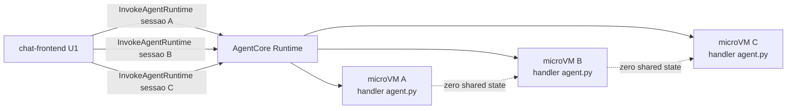

**Collaborator:** aidlc-architect-agent (com input do aidlc-aws-platform-agent)

# Scalability Design - Unit hr-agent

Design de escalabilidade implementando `scalability-requirements.md`
(NFR6.1.x, NFR6.2.x, NFR10.1.1). Padrao dominante: **delegar** ao AgentCore
Runtime; o codigo do agente permanece stateless e nao adiciona controle
proprio de concorrencia.

## Sources

- [sc] `scalability-requirements.md` — NFR6.1.1, NFR6.1.2, NFR6.2.1,
  NFR6.2.2, NFR10.1.1.
- [ts] `tech-stack-decisions.md` — AgentCore Runtime como model runtime
  gerenciado; Strands + boto3.
- [fs] `functional-spec.md` § Deployment shape (microVM per session),
  § State (stateless).
- [cs] `contract-summary.md` § C1 SLA (NFR6.1 1-3 sessoes), § C1 Erros
  (`ThrottlingException` cadeia).
- [rl] `rules.md` BR7.1 (statelessness), BR6.1 (label -> ARN).
- [pr] `performance-requirements.md` NFR1.1.4 (dois modelos <5s).
- [q3] Q3=A do stage anterior — delegar comportamento >3 sessoes ao Runtime.

## Design Decisions

### SCD-1 — Horizontal scaling: delegado ao AgentCore Runtime

**Requirement**: NFR6.1.1 (1-3 sessoes), NFR6.1.2 (>3 sessoes = Runtime
decide).

**Design**: o codigo do agente NAO implementa horizontal scaling ativo — nao
ha threadpool custom, nao ha async workers, nao ha sharding manual. Cada
`InvokeAgentRuntime` -> microVM alocada pelo Runtime -> handler roda -> retorna.

Padrao arquitetural: **microVM-per-session-lifecycle** (isolamento nativo
por `runtimeSessionId`), com Runtime gerenciando o pool de microVMs.

**Rationale**: infra managed = zero engenharia de scaling do nosso lado. E
o modelo mais barato de operar para 1-3 sessoes em 2 dias. Alternativa
(ECS/Lambda com autoscale group custom) adicionaria semanas de setup.

### SCD-2 — Backpressure: sem controle proprio, natively via `ThrottlingException`

**Requirement**: NFR6.1.2 (>3 sessoes -> Runtime enfileira ou lanca
throttle).

**Design**: quando o Runtime satura (excede quota interna ou capacidade
de microVMs), ele responde com `ThrottlingException` ou
`ServiceQuotaExceededException` — cadeia de erro flui:

1. Runtime lanca `ThrottlingException`.
2. boto3 client do U1 (`bedrock-agentcore`) tenta ~3x com backoff padrao
   (standard retry mode).
3. Se persistir, `botocore.exceptions.ClientError` sobe.
4. `AgentInvoker` (U1) converte para `AgentInvocationError`
   (`contract-summary § C1 Erros`, tp § Code Style).
5. chat-frontend renderiza `st.error(...)` amigavel (AC1.7.2, BR6.1
   chat-frontend).

**Rationale**: cadeia ja definida por contratos anteriores; nada novo aqui.
Design formaliza que **nao ha circuit-breaker** entre passos 2 e 5 no lado
do agente.

**Sensor observable**: quando `st.error` dispara consistentemente durante
demo, operador sabe imediatamente que atingiu limite — sinal legivel para
humano, sem precisar ler CloudWatch.

### SCD-3 — Nenhum tuning per-session (statelessness pattern)

**Requirement**: NFR10.1.1 (statelessness como facilitador de escala),
BR7.1.

**Design**: o handler nao mantem estado entre invocacoes de qualquer tipo:

- Sem cache in-memory (nem por session, nem global).
- Sem contador de invocacoes.
- Sem "aquecimento" de modelos (cada `BedrockModel(model_id=arn)` e
  criado fresh a cada `invoke()`).
- Sem estruturas de fila internas.

Cada microVM e efetivamente cattle: pode ser terminada e recriada sem custo
de state migration.

**Rationale**: statelessness torna escala horizontal trivial (nao ha
consistency issue) e recovery trivial (`reliability-design.md § RD-2`).
Tradeoff aceito: `retrieve` roda em toda invocacao — sem cache de embeddings.

### SCD-4 — Modelo escolhido nao altera curva de escala do handler

**Requirement**: NFR6.2.2.

**Design**: `context.model_id` no payload C1 seleciona qual `BedrockModel`
o handler instancia (Q4 do functional-design). O restante do handler
(prompt, retrieve, log) e identico para os 2 modelos. Portanto:

- Curva de latencia por modelo varia (`performance-design § PD-7`).
- Curva de escala (sessoes suportadas) NAO varia — determinada pelo
  Runtime + quota Bedrock, ambos indiferentes ao label.

**Rationale**: mantem simetria entre modelos. Se Nova Pro tiver quota maior
que Claude Haiku no dia da demo, operador pode preferir Nova Pro; caso
contrario, escolha e por qualidade percebida, nao por escala.

### SCD-5 — Data growth: nao aplicavel ao agente

**Requirement**: implicito em `scalability-requirements § Data Growth`.

**Design**: o agente NAO persiste dados. Growth do S3 bucket (documentos)
e do S3 Vectors (embeddings) e gerenciado por U3. O agente:

- Nao escreve no S3.
- Nao escreve no S3 Vectors.
- Nao cria logs alem do INFO estruturado por invocacao (limpo pelo
  retention default do CloudWatch).

**Rationale**: consequencia de statelessness. Zero design work — mas
explicito para o revisor validar que o unit realmente nao tem eixo de
crescimento de dados.

### SCD-6 — Capacity thresholds e migration path pos-workshop

**Requirement**: NFR6.2.1 (sem alvos alem do MVP).

**Design**: quando/se demanda pos-workshop justificar escala:

| Trigger | Migration path | Reabre stage |
|---------|----------------|--------------|
| >3 sessoes concorrentes de forma sustentada | Solicitar quota adicional do AgentCore Runtime via AWS support ticket | Nenhuma reabertura — quota bump e operacional |
| Latencia p95 estoura consistentemente | Trocar default para Nova Pro (mais throughput observado) OU implementar cache limitado (viola BR7.1) | Reabre `nfr-requirements § NFR1.1.2` |
| Falhas de `ThrottlingException` recorrentes mid-demo | Adicionar circuit-breaker no `AgentInvoker` (nao no agente!) | Reabre `contract-summary § C1 Erros` |

**Rationale**: registrar triggers concretos evita reagir a ruido; cada
trigger tem custo/benefit claro e ponto de reabertura de contrato.

**Nao no MVP**: caching de resposta, sharding por documento/tenant,
multi-region deployment, ativa-passivo.

## Failure Modes Under Load

| Load condition | Comportamento esperado | Sensor observavel |
|---------------|------------------------|-------------------|
| 1-3 sessoes simultaneas (target) | Latencia <5s consistente | `scripts/smoke.py` mede |
| 4-6 sessoes brevemente | boto3 default retry absorve; latencia sobe | Log INFO `response_ms` cresce; sem `outcome=error` |
| 7+ sessoes sustentadas | `ThrottlingException` propaga ate `st.error` | Log ERROR + `st.error` no frontend |
| Bedrock model quota exceeded | mesmo caminho `ThrottlingException` | idem |
| KB retrieval falha (5xx) | `ClientError` propaga; log ERROR | log ERROR com `error_type=ClientError` |

Nenhum caminho requer intervencao de codigo no agente.

## Anti-Patterns Rejected

- **Circuit-breaker no agente** — Q3=A rejeita opcao C.
- **Rate limit interno** — delegado ao Runtime (Q3=A).
- **Cache de respostas por session** — viola BR7.1 (statelessness).
- **Threadpool async no handler** — invocacao ja e sync single-shot por
  contrato C1; async nao adiciona valor num modelo microVM-per-session.
- **Sharding por documento/tenant** — KB unificada, sem tenancy no MVP.
- **Backup pool de modelos** — se Claude Haiku throttle, cair no Nova Pro
  automaticamente seria design de failover. Q3=A e Q4=A do functional
  design rejeitam qualquer selecao automatica; o operador troca manualmente.

## Assumptions & Open Questions

None.
