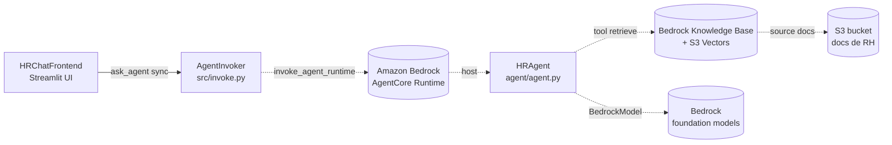

**Collaborator:** aidlc-architect-agent

# Components - Chatbot de RH com Bedrock AgentCore

Componentes logicos (blocos de codigo que escreveremos) para o Chatbot de
RH. Infraestrutura, servicos gerenciados e o vector store aparecem como
`external_dependencies`, nao como componentes.

Fontes consumidas: `requirements.md` (FR/NFR), `stories.md` (11 stories,
28 ACs), `team-practices.md` (fronteiras de camada, stack).

## Sources

- [rq] `requirements.md` - FR1-FR9 e NFR1-NFR10.
- [st] `stories.md` - US1.1..US4.1 (11 stories, 28 ACs).
- [tp] `team-practices.md` - Python 3.12; `frontend/ -> src/ -> boto3`;
  `agent/` isolado.
- [q1] Q1 = A - 3 componentes espelhando as fronteiras de camada.
- [q2] Q2 = A - `HRAgent` sem `SystemPrompt` como entity.
- [q3] Q3 = B - `ChatMessage`, `ChatSession`, `ModelChoice`. Sem
  `AgentInvocationError` como entity (exception idiomatica).
- [q4] Q4 = A - todas as interacoes `sync`.
- [q5] Q5 = C - N/A.

## Catalogue

```yaml
components:
  - name: HRChatFrontend
    summary: Aplicacao Streamlit que renderiza o chat de RH e captura a interacao do colaborador.
    behaviour: >
      Renderiza a saudacao inicial, o historico de bolhas, o dropdown de modelo,
      o botao "Limpar conversa" e o input de chat. Gera `session_id` via `uuid.uuid4()`
      no primeiro carregamento (nunca aceita do usuario). Guarda o input em 4000 chars
      antes de invocar o agente (mostra `st.warning(...)` se exceder). Renderiza a
      resposta em texto plano em portugues, sem citar documento fonte. Captura
      `AgentInvocationError` (do AgentInvoker) e renderiza `st.error(...)` amigavel;
      loga o erro original via `logging.getLogger(__name__)`. Preserva historico ao
      trocar de modelo; zera historico + gera novo `session_id` ao clicar "Limpar
      conversa". Mostra `st.caption("Modelo em uso: {model_id}")` no cabecalho e o
      caption `{n}/4000` apos submit quando 3500 < len(prompt) <= 4000. Sem CSS
      customizado; usa apenas widgets nativos Streamlit ([rq FR4, FR7-FR9], [st US1.6,
      US1.7, US1.9, US4.1], [tp § Code Style], [q3 B]).
    responsibilities:
      - Renderizar a UI de chat (bolhas, saudacao, spinner, warning, error) sem CSS custom.
      - Gerar `session_id` server-side via `uuid.uuid4()` no primeiro carregamento e em "Limpar conversa".
      - Guard de comprimento de input (rejeitar >4000 chars com `st.warning`) - defense-in-depth ao guard do AgentInvoker.
      - Gerenciar `st.session_state.messages`, `st.session_state.session_id`, `st.session_state.model_id`.
      - Resolver o rotulo humano do modelo em inference profile ARN via dicionario `MODEL_ARNS`.
      - Chamar o `AgentInvoker` (sync) e renderizar a resposta ou o erro amigavel.
      - Logar o erro original via `logging.getLogger(__name__)` sem expor traceback na UI.
    depends_on:
      - component: AgentInvoker
        interaction: Chamar `ask_agent(prompt, session_id, model_id)` por turno de chat.
        style: sync
    dependents: []
    external_dependencies:
      - name: Streamlit
        kind: other
        purpose: Framework de UI web renderizada localmente (`streamlit run frontend/app.py`).
    entities:
      - name: ChatSession
        identifier: session_id
        attributes: [session_id, messages, model_id]
      - name: ChatMessage
        identifier: session_id + index
        attributes: [role, content]
        references:
          - entity: ChatSession
            owned_by: HRChatFrontend
            relationship: cada ChatMessage pertence a exatamente uma ChatSession (pela ordem em `messages`).
      - name: ModelChoice
        identifier: label
        attributes: [label, inference_profile_arn]
        references:
          - entity: ChatSession
            owned_by: HRChatFrontend
            relationship: uma ChatSession referencia um ModelChoice via `model_id` (o `label`).

  - name: AgentInvoker
    summary: Cola de invocacao entre o frontend e o AgentCore Runtime; encapsula o cliente boto3 e a politica de erro.
    behaviour: >
      Expoe `ask_agent(prompt, session_id, model_id) -> str`. Valida `len(prompt) <=
      4000` antes de qualquer chamada externa, levantando `ValueError` se exceder
      (guard primario; o frontend faz defense-in-depth). Invoca
      `bedrock-agentcore:InvokeAgentRuntime` (nao `bedrock-agent-runtime`) em
      `us-east-1`, passando o `session_id` como `runtimeSessionId` e o `model_id`
      (resolvido em ARN de inference profile) como parametro do payload. Captura
      `botocore.exceptions.ClientError` (throttling, timeout, IAM, ResourceNotFound,
      resposta vazia) e re-eleva como `AgentInvocationError` de dominio com mensagem
      legivel. Cliente boto3 e criado uma unica vez em nivel de modulo. Nao conhece
      Streamlit nem o codigo interno do agente. ([rq FR3, FR6, FR8, FR9], [st US1.6,
      US1.7], [tp § Code Style Error handling policy], [project.md § Mandated]).
    responsibilities:
      - Validar comprimento do prompt (<= 4000 chars) - guard primario com `ValueError`.
      - Encapsular a chamada `bedrock-agentcore.InvokeAgentRuntime` em `us-east-1`.
      - Capturar `ClientError` do botocore e re-elevar como `AgentInvocationError`.
      - Definir e possuir a excecao de dominio `AgentInvocationError` (Python exception, nao entity de dado).
      - Nunca aceitar `session_id` de fonte nao confiavel; o frontend so o gera, este componente so o repassa.
    depends_on: []
    dependents:
      - component: HRChatFrontend
        interaction: HRChatFrontend chama `ask_agent(...)` sync por turno.
    external_dependencies:
      - name: Amazon Bedrock AgentCore Runtime
        kind: third-party-api
        purpose: Servico gerenciado que hospeda o `HRAgent` em microVM por sessao; alvo do `invoke_agent_runtime`.
      - name: boto3 (client `bedrock-agentcore`)
        kind: other
        purpose: SDK AWS para chamada ao AgentCore Runtime.
    entities: []

  - name: HRAgent
    summary: Agente Strands que responde em portugues consultando a Knowledge Base de RH e aplicando as regras de LGPD.
    behaviour: >
      Construido com Strands Agents SDK (`strands` + `strands_tools`). System prompt
      fixo com diretrizes: responder em portugues em 2 a 4 frases, tom formal-neutro
      breve e direto; usar exclusivamente conteudo da Knowledge Base via tool
      `retrieve`; nao inventar informacao (fallback "Nao encontrei... contate o RH");
      recusar dados individuais de colaboradores (LGPD - responder "Nao posso
      compartilhar informacao pessoal ... procure o RH"); jamais expor salario,
      historico pessoal ou nome individual como sujeito de dado. `BedrockModel` do
      Strands recebe o `model_id` resolvido como inference profile ARN (`us.*` sempre
      via inference profile). Corre dentro de microVM gerenciada do AgentCore Runtime
      (deploy separado); nao importa de `src/` nem `frontend/`. Sessao isolada por
      microVM (garantia do servico). ([rq FR1, FR2, FR3, FR5, FR6, NFR4], [st US1.1-5,
      US2.1, US3.1, US4.1], [tp § Code Style, agent/ isolado], [project.md § Forbidden,
      § Mandated]).
    responsibilities:
      - Aplicar o system prompt de RH (portugues, tom breve, LGPD, sem inventar).
      - Consultar a Knowledge Base via tool `retrieve` do Strands SDK.
      - Emitir resposta final em portugues consumida pelo AgentInvoker.
      - Recusar dados individuais (contrato de contains: "RH" + keyword de recusa).
      - Emitir fallback "nao encontrei" quando `retrieve` nao trouxer trechos relevantes.
      - Isolar-se de `src/` e `frontend/`; nao importar codigo deles.
    depends_on: []
    dependents:
      - component: AgentInvoker
        interaction: AgentInvoker invoca o HRAgent atraves do AgentCore Runtime; nao ha chamada Python direta.
    external_dependencies:
      - name: Strands Agents SDK
        kind: other
        purpose: Framework do agente (`strands`, `strands_tools`).
      - name: Amazon Bedrock foundation models
        kind: third-party-api
        purpose: Modelos Claude Haiku 4.5, Amazon Nova Pro (via inference profile ARN).
      - name: Amazon Bedrock Knowledge Bases
        kind: third-party-api
        purpose: RAG - a tool `retrieve` do Strands consulta a KB.
      - name: S3 Vectors
        kind: object-store
        purpose: Vector store da Knowledge Base (gerenciado, transparente para o agente).
      - name: S3 (bucket dos documentos)
        kind: object-store
        purpose: Origem dos 5 documentos de RH (SSE-S3), ingeridos pela KB.
    entities: []
```

## Component Diagram



Linhas solidas: chamada `sync` entre componentes que escrevemos. Linhas
tracejadas: chamada para `external_dependencies` (servicos gerenciados,
nao componentes).

## Component Summary

| Component        | Purpose                                                            | Depends On     | Dependents        | Entities Owned                          |
| ---------------- | ------------------------------------------------------------------ | -------------- | ----------------- | --------------------------------------- |
| HRChatFrontend   | UI Streamlit de chat de RH com guard 4000 chars e tratamento de erro | AgentInvoker   | -                 | ChatSession, ChatMessage, ModelChoice   |
| AgentInvoker     | Cola boto3 para AgentCore Runtime, guard 4000 e mapping de erro    | -              | HRChatFrontend    | -                                       |
| HRAgent          | Agente Strands + RAG na KB + regras LGPD, dentro do AgentCore Runtime | -           | AgentInvoker (via AgentCore Runtime) | -                                       |

## Entity Ownership

| Entity        | Owning Component | Identifier         | Attributes                             | References                              |
| ------------- | ---------------- | ------------------ | -------------------------------------- | --------------------------------------- |
| ChatSession   | HRChatFrontend   | session_id         | session_id, messages, model_id         | ModelChoice (via `model_id` = `label`)  |
| ChatMessage   | HRChatFrontend   | session_id + index | role, content                          | ChatSession (via ordem em `messages`)   |
| ModelChoice   | HRChatFrontend   | label              | label, inference_profile_arn           | -                                       |

## External Dependencies

| Component      | Dependency                              | Kind             | Purpose                                                         |
| -------------- | --------------------------------------- | ---------------- | --------------------------------------------------------------- |
| HRChatFrontend | Streamlit                               | other            | Framework de UI web, execucao local.                            |
| AgentInvoker   | Amazon Bedrock AgentCore Runtime        | third-party-api  | Alvo do `invoke_agent_runtime` (hospeda o HRAgent).             |
| AgentInvoker   | boto3 (`bedrock-agentcore`)             | other            | SDK AWS - client de invocacao.                                  |
| HRAgent        | Strands Agents SDK                      | other            | Framework do agente.                                            |
| HRAgent        | Amazon Bedrock foundation models        | third-party-api  | Modelos consumidos via inference profile ARN.                   |
| HRAgent        | Amazon Bedrock Knowledge Bases          | third-party-api  | RAG via tool `retrieve` do Strands.                             |
| HRAgent        | S3 Vectors                              | object-store     | Vector store da KB (gerenciado).                                |
| HRAgent        | S3 (bucket dos documentos)              | object-store     | Origem dos 5 documentos de RH, SSE-S3.                          |

## Rationale

| Component      | Motivo para ser um bloco separado                                                                    |
| -------------- | ---------------------------------------------------------------------------------------------------- |
| HRChatFrontend | **Ciclo de vida distinto** (roda localmente no notebook de cada participante), **stack distinta** (Streamlit vs boto3 vs Strands), **taxa de mudanca distinta** (UI muda rapido, ARNs sao estaveis). Encapsula toda a UX de RH e o guard >4000 defense-in-depth. |
| AgentInvoker   | **Fronteira de dependencia** que isola boto3 do frontend Streamlit ([tp]). Guard 4000 primario mora aqui - o frontend so o replica como defense-in-depth. Politica de erro (`ClientError -> AgentInvocationError`) e responsabilidade unica; testavel isoladamente sem AWS real. |
| HRAgent        | **Roda em processo separado** (microVM AgentCore Runtime); **deploy separado** via CDK; **impossivel importar `src/` ou `frontend/`**; **superficie de teste diferente** (mock `BedrockModel` + stub `retrieve`). O system prompt LGPD e o RAG sao intrinsicos deste bloco; nao poderiam viver no frontend ou no invoker sem quebrar a fronteira de camada. |

**Alternatives Rejected** (registradas em detalhe em `decisions.md`):

- **Fundir HRChatFrontend + AgentInvoker em um so `HRChatApp`** (Q1 opcao B): rejeitado porque o guard 4000 e a politica de erro ganham em testabilidade quando isolados de Streamlit; a fronteira `frontend/ -> src/` de `team-practices` fica ambigua.
- **Separar `KnowledgeBaseRetriever` como componente proprio** (Q1 opcao C): rejeitado porque a tool `retrieve` do Strands e uma dependencia externa que o SDK resolve por env var (`KNOWLEDGE_BASE_ID`); nao ha codigo de negocio nosso a possuir. Fica como `external_dependency` do `HRAgent`.
- **Capturar `AgentInvocationError` como entity de dominio** (Q3 opcao C): rejeitado porque em Python idiomatico e uma excecao, nao uma estrutura de dados persistida ou consultada. Fica no `behaviour` do `AgentInvoker` (Q5 N/A).
- **Capturar `SystemPrompt` como entity do `HRAgent`** (Q2 opcao B): rejeitado no MVP porque o system prompt e uma string fixa no codigo do agente, sem consulta/persistencia; adicionar uma entity so aumenta ruido. Se o time quiser trocar prompt por env var pos-demo, reavaliar.

## Assumptions & Open Questions

None.

<!-- confirmed 2026-08-24 -->

## Review

**Reviewer:** aidlc-architecture-reviewer-agent
**Date:** 2026-08-24
**Iteration:** 1
**Review class:** advisory
**Verdict:** READY

### Findings

| # | Severity | Location | Finding | Recommendation |
|---|----------|----------|---------|----------------|
| 1 | Minor | `components.md` § Catalogue - blocos `AgentInvoker` e `HRAgent` | Assimetria em `depends_on`/`dependents`: `HRAgent.dependents` lista `AgentInvoker` ("AgentInvoker invoca o HRAgent atraves do AgentCore Runtime"), mas `AgentInvoker.depends_on` esta `[]`. A justificativa esta correta em prosa (nao ha chamada Python direta; a mediacao e o AgentCore Runtime como `external_dependency`), mas a relacao ficou registrada em apenas uma ponta. O invariante de simetria do catalogo YAML pede que as duas listas concordem. | Escolher uma das duas leituras e aplicar em ambas as pontas: (a) remover a entrada `AgentInvoker` de `HRAgent.dependents` e deixar o vinculo somente via `external_dependencies.Amazon Bedrock AgentCore Runtime` (leitura estrita: sem dependencia code-level, sem entrada no par depends_on/dependents); ou (b) adicionar `HRAgent` em `AgentInvoker.depends_on` com `interaction` idem e `style: sync` (leitura logica: registrar o vinculo funcional apesar de mediado). A leitura (a) e a mais consistente com o resto do documento e com ADR-005. |
| 2 | Minor | `traceability.json` - linhas US1.6 e US1.7 | US1.6 e US1.7 estao mapeadas somente para `AgentInvoker`, mas ambos os ACs terminam no `HRChatFrontend` (AC1.6.1 exige `st.warning(...)` no frontend; AC1.7.2 exige `st.error(...)` no frontend; AC1.7.3 exige `logging.getLogger(__name__)` no frontend). Elas cruzam a fronteira `frontend/ -> src/` por design (guard primario e error mapping no invoker, renderizacao amigavel no frontend). O target unico esconde essa cobertura compartilhada. | Ampliar o schema de `coverage` para permitir multi-target por story (ex.: `"target": ["AgentInvoker", "HRChatFrontend"]`) e reescrever US1.6/US1.7 apontando para ambos. Alternativa mais leve: adicionar campo `secondary_target` sem alterar o schema principal. Fica como sugestao editorial - o dominio nao esta errado, so pouco expressivo. |
| 3 | Minor | `components.md` § Catalogue - `HRChatFrontend.entities.ChatSession` e `ChatMessage` | `ChatSession.attributes` lista `messages` como atributo, e `ChatMessage` tem `references` para `ChatSession`. A cardinalidade "1 ChatSession -> N ChatMessage" so aparece em prosa dentro de `relationship`. Nao ha campo estrutural que diga "list of ChatMessage" ou cardinalidade explicita. Coerente com a instrucao "sem types/validation" (Q3), mas beira a linha entre "shape" e "ausencia de shape". | Aceitavel como esta no MVP. Se aparecer duvida em `functional-design` sobre a ordem/duplicidade do historico, materializar a cardinalidade no proprio `relationship` (ex.: "1 ChatSession possui N ChatMessage, ordenadas por `index` monotonico crescente"). Nao bloqueia. |

### Verificacoes que passaram

| Criterio | Resultado | Evidencia |
|---|---|---|
| Unicidade de `name` no catalogo | PASS | 3 nomes distintos: `HRChatFrontend`, `AgentInvoker`, `HRAgent`. |
| Sem self-dependency | PASS | Nenhum componente aparece em seu proprio `depends_on`/`dependents`. |
| Sem dangling references em componentes | PASS | Toda referencia (`AgentInvoker` em HRChatFrontend.depends_on; `HRChatFrontend` em AgentInvoker.dependents; `AgentInvoker` em HRAgent.dependents) resolve para um `name` existente. |
| DAG (ausencia de ciclo) | PASS | Unica aresta declarada em `depends_on`: HRChatFrontend -> AgentInvoker. Sem ciclo. |
| Entity ownership exatamente um | PASS | `ChatSession`, `ChatMessage` e `ModelChoice` todas com dono unico `HRChatFrontend`. |
| Cobertura das 11 stories em `traceability.json` | PASS | Contagem em `stories.md`: US1.1, US1.2, US1.3, US1.4, US1.5, US1.6, US1.7, US1.9, US2.1, US3.1, US4.1 = 11. `traceability.json.upstream_ids` lista as 11 e `coverage` traz status `OK` para cada. |
| Estrutura Context/Decision/Consequences/Alternatives Rejected nos ADRs | PASS | ADR-001 a ADR-005 seguem a estrutura; ADR-001, 003 e 005 separam `Consequences (+)` e `Consequences (-)` (formato org.md); ADR-002 e 004 tambem. Todos com secao `Alternatives Rejected` nao vazia. |
| Fronteiras `frontend/ -> src/ -> boto3` respeitadas | PASS | `HRChatFrontend.depends_on = [AgentInvoker]` (frontend->src); `AgentInvoker` possui `boto3` como `external_dependency` (src->boto3); `HRChatFrontend` nao lista `boto3` como dependencia direta. Coerente com `team-practices.md § Code Style`. |
| `agent/` isolado (sem importar de `src/` ou `frontend/`) | PASS | `HRAgent.depends_on = []`; responsabilidades explicitam "Isolar-se de `src/` e `frontend/`"; a comunicacao com AgentInvoker esta descrita como mediada pelo AgentCore Runtime (external), nao como import Python. Confirma o invariante do `team-practices.md`. |
| Entities capturadas em ownership+shape apenas (sem types/validation) | PASS | Nenhuma entity tras anotacao de tipo (`str`, `list`, etc.) ou regra de validacao. Somente `identifier`, `attributes` e `references`. Coerente com Q3=B. |
| upstream-coverage: referencia a requirements, stories, team-practices | PASS | `components.md § Sources` cita explicitamente `requirements.md` (`[rq]`), `stories.md` (`[st]`), `team-practices.md` (`[tp]`); `decisions.md § Sources` idem; ADRs 001 e 002 citam `[tp]`; ADR-003 cita `project.md § Mandated` (NFR3.2). |
| Rastreabilidade AC-especifica nos `behaviour` | PASS (bonus) | Cada bloco `behaviour` fecha com tags `[rq ...]`, `[st ...]`, `[tp ...]` alem das linhas de contexto. Facilita o `traceability` sensor downstream. |

### Sugestoes (nao bloqueantes)

- **S1 - Materializar a mediacao AgentCore Runtime no diagrama de dependencia estrutural.** Hoje o Component Diagram Mermaid deixa isso claro (`AgentInvoker -.-> ACR -.-> HRAgent`), mas o `## Component Summary` mostra "Dependents: AgentInvoker (via AgentCore Runtime)" numa coluna e depois nao aparece na tabela `Depends On` do proprio AgentInvoker. Alinhar as duas colunas apos a resolucao do Finding #1.
- **S2 - Considerar tornar explicito no `behaviour` do `HRChatFrontend` o custo do guard duplicado 4000 chars.** O texto ja diz "defense-in-depth" e ADR-002 justifica a separacao, mas para o desenvolvedor que le so o catalogo pode nao ficar claro se um guard sem o outro seria aceitavel. Uma frase curta ("A ausencia de qualquer um dos dois nao viola o contrato de US1.6, mas remove a linha de defesa correspondente") ajudaria em `code-generation`.
- **S3 - Registrar em `decisions.md` (ou linkar ADR de contract-design) o `runtimeSessionId` como nome de campo canonico.** O `behaviour` do `AgentInvoker` menciona "runtimeSessionId" uma vez. Como a assinatura publica do `invoke_agent_runtime` do boto3 vai ser fixada em `contract-design`, vale confirmar ali se o nome do parametro e mesmo `runtimeSessionId` ou variacao. Nao bloqueia domain-design.
- **S4 - `ModelChoice.identifier: label` cria um acoplamento textual com o dicionario `MODEL_ARNS`.** Se dois modelos ganharem o mesmo rotulo humano ("Claude Haiku" em duas versoes), a unicidade quebra. Coerente com escopo `mvp`, mas vale registrar como assumption em `functional-design` para que o codigo em `code-generation` nao invente ID sintetico.

### Summary

O catalogo esta bem-formado, coerente com `team-practices.md`, e as 11 stories estao rastreadas. Os cinco ADRs estao completos e respondem exatamente as decisoes tomadas em Q1-Q5. As entidades ficaram no nivel de ownership+shape como pedido. Ha uma assimetria menor em `depends_on`/`dependents` entre `AgentInvoker` e `HRAgent` (Finding #1) que a prosa ja explica, e dois pontos de rastreabilidade que podem ganhar expressividade (Findings #2 e #3). Nenhum finding e Critical ou Major; num pass advisory o veredito e READY - a decisao final permanece com o humano na aprovacao do gate.
